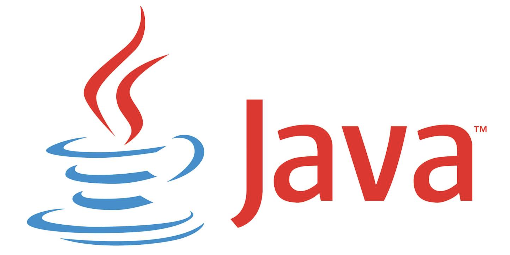

# Java Study

> 해당 레포는 '백기선'님과 함께 하는 Java 스터디를 위한 공간입니다. 🤗
>
> 과제 레포 → [here!](https://github.com/whiteship/live-study/issues)

### # 1주 차

* [JVM은 무엇이며 자바 코드는 어떻게 실행하는 것인가.](week1/week1.md)

### # 2주 차

* [자바 데이터 타입, 변수 그리고 배열](week2/week2.md)

### # 3주 차

* [연산자](week3/week3.md)

### # 4주 차

* [제어문](week4/week4.md)
* [JUnit 5 학습](week4/week4_0.md)
* [Live-study 대시보드 만들기](week4/week4_1.md)
* [LinkedList 구현](week4/week4_2.md)
* [Stack 구현](week4/week4_3_and_4.md)
* [Queue 구현](week4/week4_5.md)

### # 5주 차

* [클래스](week5/week5.md)
* [BinaryTree 구현](week5/week5_1.md)

### # 6주 차

* [상속](week6/week6.md)

