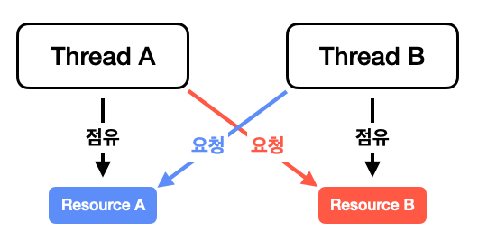

# 멀티 쓰레드 프로그래밍

### 📖목표

> 자바의 멀티 쓰레드 프로그래밍에 대해 학습하여라

<br>

## 프로세스와 쓰레드

프로그래밍을 공부하거나 면접에서 당골로 나오는 질문 중 하나는 프로세스와 쓰레드 그리고 그 둘의 차이점일 것이다. 구글링을 통해 자세히 설명해 둔 것들이 굉장히 많으니 여기서는 간단하게 짚고 넘어가도록 하겠다.

#### 프로세스

> 프로세스는 우리가 흔히 알고 있는 프로그램이 OS로 부터 메모리에 할당받아 실행되고 있는 상태를 말한다. 주변에 가까운 시선으로 비교하자면, 공장에 어떤 작업을 위해 작업대 하나를 마련한것과 같다. 서로 다른 작업대(프로세스)는 각자 공간을 할당 받기 때문에 독립적으로 서로 다른 작업대에 영향을 끼칠 수 없다. 조금 더 들어가보자면, 프로세스끼리도 통신을 하여 정보를 주고 받을 수는 있다.

### 쓰레드

> 쓰레드는 프로세스 안에서 작업을 하는 주체라고 말할 수 있다. 즉, 프로세스에 할당된 메모리를 사용하여 프로그램이 돌아갈 수 있도록 코드를 실행하고 사용자의 명령을 수행하는 역할을 맡는다. 공장에 작업대가 존재한다면 그 안에 일하는 사람이 있어야 물건을 만들수 있듯 프로세스라는 작업대에는 쓰레드라는 워커가 일을 하고 있는 것이다. 
>
> 워커는 한 사람이 될 수 있고 여러 사람(**멀티 쓰레드**)이 될 수 있다. 여러명이서 병렬로 처리하여 빠르게 수행할 수도 있고 다른 종류의 일을 할 수 도 있는 것이다. 하나의 작업대 안에서 일하기 때문에 특별한 수단 없이도 데이터를 공유할 수 있다. 물론 자신이 어디까지 일했는가를 알기 위해서는 작업 일지(Stack 영역)는 서로 가지고 있다. 작업대를 공유하고 있기에 하나의 워커가 작업대를 망친다면, 다른 워커들 까지도 멈출 수 밖에 없다.

<br>

## 쓰레드의 종류

자바에서는 두 종류의 쓰레드를 제공한다. 이는 **User Thread와 Daemon Thread** 이다.

* User Thread

  > 우선순위가 높은 쓰레드로 JVM은 해당 쓰레드의 작업이 끝날 때까지 종료되지 않고 기다린다.

* Daemon Thread

  > 우선순위가 낮은 쓰레드로 유저 쓰레드의 작업을 도와주는 역할을 한다. 만약, 모든 유저 쓰레드가 종료 된다면 데몬 쓰레드 또한 바로 종료된다. 그렇기 때문에 데몬 쓰레드 안에서 무한 루프 로직이 있어도 문제를 야기하지 않는다.
  > (I/O 작업을 데몬 쓰레드 안에서는 비 추천)
  >
  > 데몬 쓰레드의 대표적인 예가 바로 Garbage Collection이다. 
  >
  > 이를 만들기 위해서는 기본적인 쓰레드와 같이 생성한 뒤 setDaemon 메소드를 사용하여 설정을 해주면 된다.

<br>

## 메인 쓰레드

자바 프로그램이 시작되면 JVM에 의해 쓰레드 하나가 바로 실행되는데 이를 메인 쓰레드라고 한다. 메인 쓰레드에서는 첫번째로  main 메소드의 존재를 확인하고 이후 클래스를 초기화 한다.(JDK 6부터 main 메소드 필수) 이러한 메인 쓰레드에서 유저 쓰레드 혹은 데몬 쓰레드를 생성하여 사용한다. 만약 메인 쓰레드 외에 유저 쓰레드가 아직도 작업중이라면, 메인 쓰레드가 종료되어도 프로그램은 종료되지 않는다.


출처 : [Main thread in Java - GeeksforGeeks](https://www.geeksforgeeks.org/main-thread-java/)

<br>

## 쓰레드 생성하기

자바에서 이 쓰레드를 생성하는 방법은 2가지가 존재한다.

1. Runnable 인터페이스를 구현
2. Thread 클래스를 상속

### Runnable 인터페이스

Runnable 인터페이스의 경우 추상 메소드로 run 메소드만 존재한다.

```java
public interface Runnable {
    public abstract void run();
}
```

즉, 쓰레드를 생성하고 실행시에 어떠한 동작을 할지 구현하고 이를 쓰레드 생성시에 인자로 넘겨주기만 하면 된다.

```java
public class App {
    public static void main(String[] args) {
        Thread customThread = new Thread(new CustomThread());
        customThread.start();
    }
}

class CustomThread implements Runnable {
    @Override
    public void run() {
        System.out.println("Custom Thread 실행.");
    }
}
```

위와 같이 쓰레드 생성시에는 콘솔에 ""Custom Thread 실행." 이라는 문구가 나오게 된다.

위 방식 말고도 람다 혹은 익명 객체를 통해서도 생성이 가능하다.

```java
// 익명 객체
Thread customThread = new Thread() {
	@Override
	public void run() {
		System.out.println("Custom Thread 실행.");
	}
};

// 람다
Thread customThread = new Thread(() -> {
	System.out.println("Custom Thread 실행.");
});
```

### Thread 클래스 상속

Runnable 인터페이스를 구현하는것 외에 Thread 클래스를 직접 상속 받아서 사용할 수 있다. 이는 Thread 객체 또한 Runnable 인터페이스를 구현하고 있기 때문이다.

```java
class CustomThread extends Thread {
    @Override
    public void run() {
        System.out.println("Custom Thread 실행.");
    }
}
```

하지만, 위와 같이 우리가 원하는대로 Thread를 실행하기 위해서는 run 메소드를 오버라이딩 할 수 밖에 없다. 그냥 Runnable 인터페이스를 구현하는것과 다를 바가 없어 보인다. 많은 블로그 글에서도 이와 같은 상황을 말하고 있으며, **Runnable 인터페이스를 구현하라고 권장**하고 있다. 이는 Thread 클래스를 상속받게 되면 다른 클래스를 상속 받을 수 없기 때문이다. 필자가 보기에도 Thread를 직접 상속받는것 보다는 Runnable 인터페이스를 구현하는 것이 조금 더 이점이 있을 것이라고 판단된다.

<br>

## 쓰레드의 상태

쓰레드는 여러가지 상태를 가질 수 있으며, 이는 getState 메소드로 확인이 가능하다.


출처 : [Threads Introduction Life cycle](http://voyager.deanza.edu/~hso/cis35a/lecture/java14/intro/lifecycle.html)

* NEW

  > 생성만 되고 아직 실행되지 않은 상태

* RUNNABLE

  > 실행이 가능한 상태로 자원을 기다리고 있을 수도 있음

* BLOCKED

  > 공유 락이 풀릴 때까지 기다리는 상태

* WAITING

  > Object.wait, Thread.join, LockSupport.park 중 하나를 호출하여 notify 혹은 join이 끝나기를 기다리는 상태

* TIMED_WAITING

  > 지정된 대기 시간이 존재하는 상태로 다음 중 하나의 메소드를 호출한 경우
  >
  > * Thread.sleep
  > * Object.wait (timeout 존재)
  > * Thread.join (timeout 존재)
  > * LockSupport.parkNanos
  > * LockSupport.parkUntil

* TERMINATED

  > 쓰레드가 실행을 완료하여 종료된 상태

<br>

## 쓰레드 우선순위

우선 순위를 알기 전에 쓰레드의 동시성과 병렬성에 대해 살펴보도록 하자.

* 동시성(Concurrency)

  1개의 CPU 코어에서 일정한 주기마다 실행하며 주기가 굉장히 짧아 동시에 진행되는 것처럼 보이는 것

* 병렬성(Parallelism)

  여러개 CPU 코어에서 여러개의 쓰레드가 동시에 작업이 이루어지는 것

CPU 코어의 수와 쓰레드의 수가 동일하여 동시에 작업이 이루어지면 좋겠지만 그렇지 않을 경우가 있다. 동시에 여러개가 실행되어야할 때 어떤 것이 먼저 실행되어야 할까? 이러한 경우에 어떤 쓰레드를 먼저 실행시킬지를 정하게 되는데 이를 **쓰레드 스케줄링**이라고 한다.

쓰레드 스케줄링에는 두가지 방법이 존재하는데 하나는 우선순위 방식이고 다른 하나는 Round-Robin 방식이다.

* **우선순위 방식**

  말 그대로 우선 순위를 정하고 높은 우선 순위를 가진 쓰레드가 우선 실행된다. 1 ~ 10 까지 정할 수 있으며, 10이 가장 높다. 우선 순위를 할당하지 않으면 기본 값으로 5로 설정된다.

  쓰레드 클래스에서는 MAX_PRIORITY, NORM_PRIORITY, MIN_PRIORITY라는 상수 값을 가지고 있으며 각각 10, 5, 1을 가리킨다.

  ````java
  Thread thread1 = new Thread(() -> System.out.println("Thread 1"));
  Thread thread2 = new Thread(() -> System.out.println("Thread 2"));
  Thread thread3 = new Thread(() -> System.out.println("Thread 3"));
  
  thread1.setPriority(Thread.MAX_PRIORITY);
  thread2.setPriority(Thread.NORM_PRIORITY);
  thread3.setPriority(Thread.MIN_PRIORITY);
  
  System.out.println(thread1.getPriority());	// 10
  System.out.println(thread2.getPriority());	// 5
  System.out.println(thread3.getPriority());	// 1
  ````

* **Round-Robin**

  CPU 스케줄링에서의 그 라운드 로빈 방식과 동일하며, 일정 시간동안만 쓰레드의 작업을 실행하고 그 다음 작업으로 넘어간다. 이는 JVM 안에서 설정하기 때문에 개발자가 설정할 수 없다.

<br>

## 동기화

동기화란, 여러 곳에서 사용하는 데이터를 일치시키는 것을 말한다. 멀티 쓰레드 환경에서 여러개의 쓰레드들이 하나의 공유 자원을 사용하고있을 때 동시에 접근하면 데이터의 불일치가 일어날 수 있다.

만약, 십만을 카운팅하는 메소드를 실행하는 쓰레드를 2개를 만들어 보자.

```java
class SharedObject {
    private int value = 0;

    public void counting() {
        for(int i = 0; i < 100000; i++) value++;
    }

    public int getValue() {
        return value;
    }
}

public class Main extends Thread {
    public static void main(String[] args) throws InterruptedException {
        SharedObject sharedObject = new SharedObject();

        Thread thread1 = new Thread(sharedObject::counting);
        Thread thread2 = new Thread(sharedObject::counting);

        thread1.start();
        thread2.start();

        sleep(1000);
        System.out.println(sharedObject.getValue());
    }
}
```

결과는 어떻게 나올까? 당연하게 200,000이 나올것이라 생각을 할 수 있다. 그 생각과는 다르게 이십만이 꼭 나온다는 보장을 할 수 없다.

왜 그런것일까? 이는 두개의 쓰레드가 병렬로 실행되면서 더하는 도중에 바뀌지 않은 값에 접근하기 때문이다.

그렇다면 이를 해결할 수 있는 방법은 무엇일까?

바로 메소드에 **synchronized 키워드**를 사용하는 것이다. 이는 사용된 공간(메소드, 블럭)에 락을 걸어 다른 쓰레드가 접근하지 못하도록 막는다.

```java
public synchronized int locking() {
  // 메소드 전체 Lock
}

public int locking() {
  // Lock이 걸리지 않는 공간
  synchronized(공유 객체) {
  	// LOCK이 걸린는 공간
  }
  // Lock이 걸리지 않는 공간
}
```

이제 위의 예제 코드에서 counting 메소드에 synchronized 키워드를 사용하고 실행해보자.

```java
class SharedObject {
    private int value = 0;

    public synchronized void counting() {
        for(int i = 0; i < 100000; i++) value++;
    }

    public int getValue() {
        return value;
    }
}
```

이제 우리가 원하는 이십만이 나오게 될 것이다.

<br>

## 데드락(교착상태)

외나무 다리 위의 두 마리 염소란 책을 어렸을 적에 읽어 본 경험이 다들 있을 것이다. 서로 갈 길을 양보하지 않고 자신이 가기만을 원해 서로 싸우는 이야기이다.

<p align="center"></p>

서로 싸움을 하는 염소와 같이 "쓰레드 A"는 "자원 B"를 "쓰레드 B"는 "자원 A"를 추가적으로 원하고 있지만, 자신이 점유한 자원은 계속해서 점유하고 있는 상황이 발생할 수 있다. 즉, 데드락(교착상태)은 이와 같이 둘 이상의 프로세스 혹은 쓰레드가 서로 가지고 있는 자원을 원하면서 자신의 자원을 양보하지 않아 이도저도 하지 못하는 상황을 말한다.

데드락 상태가 발생하기 위해서는 다음과 같은 조건이 만족해야 된다.

* 상호배제

  > 자원을 한번에 한 프로세스/쓰레드만 사용

* 점유 대기

  > 최소한 하나의 자원을 점유하고 있으며 다른 프로세스/쓰레드에 할당된 자원을 추가적으로 점유하기 위해 대기

* 비선점

  > 다른 프로세스에 할당된 자원은 강제로 뺏을 수 없음

* 순환대기

  > 각 프로세스/쓰레드가 순환적으로 다음 프로세스/쓰레드의 자원을 요구

위와 같은 조건 하나라도 만족하지 않으면 데드락 상태가 발생하지 않는다.

### 쓰레드 교착상태 만들기

다음과 같은 코드를 사용하여 데드락 상태를 만들 수 있다.

```java
public class Main {
    public static void main(String[] args) {
        Object o1 = new Object();
        Object o2 = new Object();

      	// t1은 o1을 점유하고 있는 상태에서 o2를 요구
        Thread t1 = new Thread(new DeadLockThread(o1, o2, "Thread1"));
      	// t2는 o2를 점유하고 있는 상태에서 o1을 요구
        Thread t2 = new Thread(new DeadLockThread(o2, o1, "Thread2"));

        t1.start();
        t2.start();
    }
}

class DeadLockThread extends Thread {
    Object o1, o2;

    DeadLockThread(Object o1, Object o2, String name) {
        this.o1 = o1;
        this.o2 = o2;
        this.setName(name);
    }

    @Override
    public void run() {
      	// o1을 먼저 선점하고 있음
        synchronized (this.o1) {
            System.out.println(this.getName() + " holding : " + this.o1);
            try {
                Thread.sleep(1000);
                System.out.println(this.getName() + " waiting : " + this.o2);
              	// 추가적으로 o2를 요청
                synchronized (this.o2) {
                    System.out.println(this.getName() + " holding : " + this.o2);
                }
            } catch (InterruptedException e) {
                e.printStackTrace();
            }
        }
    }
}
```

<p align="center"></p>

<br>

---

### Reference

* [Class Thread - Oracle doc java 8](https://docs.oracle.com/javase/8/docs/api/java/lang/Thread.html)
* [Main thread in Java - GeeksforGeeks](https://www.geeksforgeeks.org/main-thread-java/)
* [JAVA 쓰레드란(Thread) ? - JAVA에서 멀티쓰레드 사용하기 - 기록하는 개발자 Blog](https://honbabzone.com/java/java-thread/#%EB%8F%99%EC%8B%9C%EC%84%B1%EA%B3%BC-%EB%B3%91%EB%A0%AC%EC%84%B1)
* [Daemon Threads in Java - Baeldung](https://www.baeldung.com/java-daemon-thread)
* [Processes and Threads - The Java™ Tutorials](https://docs.oracle.com/javase/tutorial/essential/concurrency/procthread.html)
* [Enum Thread.State - Oracle doc java 11](https://docs.oracle.com/en/java/javase/11/docs/api/java.base/java/lang/Thread.State.html#RUNNABLE)
* [Java - Thread Deadlock](https://www.tutorialspoint.com/java/java_thread_deadlock.htm)