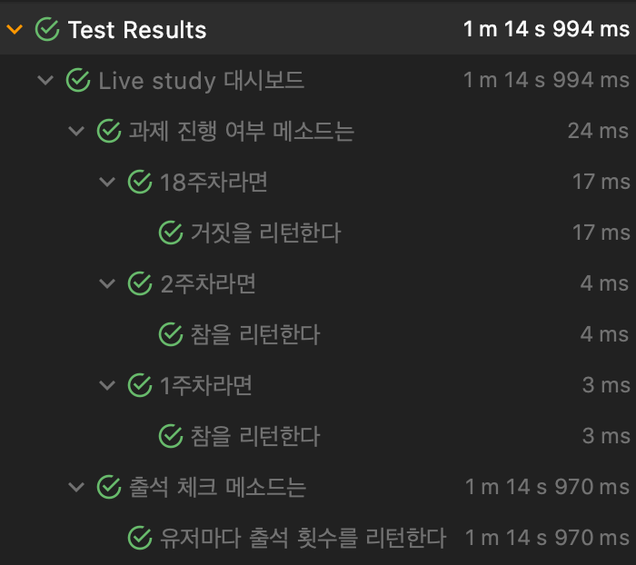

# Live-study 대시 보드 만들기

### 📖목표

> * 깃헙 이슈 1 ~ 18번까지 댓글 순회하며 사용자 체크
> * 참여율 계산(소숫점 두번째 자리까지)
> * [GitHub 자바 라이브러리](https://github-api.kohsuke.org/)를 사용
> * 테스트는 본인 이슈로 해보기

<br>

## GitHub API for Java

공식 문서에 따르면

`This library defines an object oriented representation of the GitHub API.`

라고 쓰여져 있다. GitHub API의 객체 지향적인 표현...? 이 의미는 다음 문장을 읽으면 대충 파악을 할 수 있다.

`By "object oriented" we mean there are classes that correspond to the domain model of GitHub (such as GHUser and GHRepository)`

GitHub의 도메인 모델(`GHUser`, `GHRepository` 등)에 해당되는 클래스(객체)가 존재함을 의미한다. 즉, `GHUser`와 `GHRepository`라는 객체를 생성하여 유저와 레포 관련 정보들을 얻어 사용할 수 있다는 것이다.

그렇다면, 대시보드를 만들어 가며 알아보도록 하자.

<br>

## 구현

### 0. 인증 정보 얻기

시작하기 앞서 해당 API를 사용하려면 인증이 필요하다. 인증 방법은 총 4가지가 존재하고 이에 맞게 자신의 정보가 필요하다.

* Username, Password
* Personal access token
* JWT token
* GitHub App installation token

이 중에서 마음에 드는 것을 찾으면 되고, 필자는 *Personal access token* 방식을 사용했다. 이를 얻는 방법은 [여기](https://docs.github.com/en/free-pro-team@latest/github/authenticating-to-github/creating-a-personal-access-token)를 참고하면 된다.

<br>

### 1. GitHub 객체 얻기

이제 얻은 인증 정보를 사용하여 우리가 사용할 객체들을 불러와야 한다. 앞서 *Personal access token* 방식을 사용한다 했었고 다음과 같은 코드를 사용하여 객체를 불러와야 한다.

```java
GitHub gitHub = new GitHubBuilder().withOAuthToken("얻은 토큰").build();
```

여기서 주의할 점은 우리가 얻은 토큰은 개인 정보이며 이를 공개적인 공간(GitHub)에 배포할 순 없다. 그렇기 때문에 이를 로컬에서만 관리하고 절대 퍼지지 않게 관리해야 한다.

해당 라이브러리에서도 이를 고려해서인지 Property File과 Environmental variables를 사용할 수 있게 메소드를 만들어 놓았고, 필자는 Propery File을 사용하기로 하였다.

```java
//token.properties
oauth=토큰 정보
```

위와 같이 `oauth`라는 key에 토큰 정보를 value로 해야된다. API 내부에서 `oauth`라는 식별자로 key를 찾기 때문이다.

이제 다음과 같은 코드로 `GitHub`객체를 얻을 수 있다.

```java
GitHub gitHub = GitHubBuilder.fromPropertyFile("token.properties의 위치").build();
```

<br>

### 2. 레포 정보 얻기

다음으로는 레포 정보를 얻어야 한다. 이는 이전에 얻은 `GitHub` 객체를 통해 쉽게 가져올 수 있다.

```java
GHRepository liveStudyRepo = gitHub.getRepository("ower/repo_name")
```

<br>

### 3. Issue 가져오기

이제는 Issue들을 가져와야 한다. Issue 또한 레포 정보에서 쉽게 가져올 수 있다.

```java
List<GHIssue> issueList = liveStudyRepo.getIssues(GHIssueState.ALL);
```

여기서 `GHIssueState`(Open, Close, All)를 설정하여 열린 이슈만 할 것인지 아니면 닫힌 이슈 혹은 전부를 할지를 정할 수 있다. 모든 이슈를 가져와야하므로 `GHIssueState.ALL`로 설정한다.

<br>

### 4. 출석 체크하기

가져온 Issue들을 순회하면서 각각의 댓글들을 가져오고 댓글들의 작성자들을 가져와야 한다. 여기서 주의할 점은 댓글을 중복으로 남길 수 있다는 것이다. 따라서 아이디 중복 체크를 하는 로직을 추가했다. 또한, 조금의 시간을 줄이기 위해 해당 과제가 시작되지 않았다면 제외하는 로직을 추가했다.

```java
private Map<String, Integer> takeAttendance() {
	final int INITIAL_COUNT_NUM = 1;

	// 출석 체크를 위한 HashMap -> <아이디, 출석 횟수>
	Map<String, Integer> attendanceInfo = new HashMap<>();
	try{
		List<GHIssue> issueList = liveStudyRepo.getIssues(GHIssueState.ALL);

		// 이슈 순회
		for(GHIssue issue : issueList) {
			// 해당 이슈가 시작되지 않는 과제라면 제외
			if(!isOngoingAssignment(issue.getLabels())) continue;
		
			// 이슈당 댓글 중복을 막기 위한 HashSet
			Set<String> curIssueUserList = new HashSet<>();

			// 댓글 순회
			for(GHIssueComment comment : issue.getComments()) {
				String userId = comment.getUser().getLogin();
        
				// 레포의 오너는 제외
				if(userId.equals(REPO_OWNER_ID)) continue;
        
				// 중복 제외
				if(curIssueUserList.contains(userId)) continue;
				curIssueUserList.add(userId);

				// 출석 체크
				if(attendanceInfo.containsKey(userId)) {
					attendanceInfo.put(userId, attendanceInfo.get(userId) + 1);
					continue;
				}
				attendanceInfo.put(userId, INITIAL_COUNT_NUM);
			}
		}
		return attendanceInfo;
	}catch (Exception e) {
		e.printStackTrace();
	}
	return null;
}

// 과제 시작 여부 확인 메소드
private boolean isOngoingAssignment(Collection<GHLabel> labels) {
	final String DRAFT = "draft";

	for(GHLabel label : labels) {
		if(label.getName().equals(DRAFT)) {
			return false;
		}
	}
	return true;
}
```

로직 상으로는 크게 시간이 걸리지 않을 것이라 생각했다. 제일 참여가 많은 1주차의 경우 203명이고 2주차는 157명, 3주차는 149명이기 때문이다. 라이브러리에서 이슈의 댓글을 가져오는 시간이 굉장히 오래 걸리는것 같다.(위 로직은 대략 1분 12초정도)

<br>

## 테스트

`LiveStudyDashboard` 클래스에 현재 3개의 메소드가 존재한다.

* takeAttendance

  > Issue의 댓글들을 읽고 출석 체크

* isOngoingAssignment

  > 현재 과제가 진행중이거나 진행했었는지를 판단

* getUserParticipationRate

  > 참여율을 계산하고 이를 프린트

여기서 `getUserParicipationRate` 메소드는 `takeAttendance` 메소드와 결합되어 있고 출력만 하기에 테스트 중요도가 떨어지기에 안하는게 좋을 것 같다. 따라서 `takeAttendance`와 `isOngoingAssignment`를 테스팅해 볼 것이다.

하지만, 두 메소드의 접근 제어자가 `private`로 외부 접근이 불가하다. 그렇다면 모두 `public`으로 변경한 뒤에 테스팅을 하고 다시 복구해야되는가..? 이는 굉장히 어리석은 짓인것 같다. 이 때는 Java의 Reflection을 사용하여 `private` 메소드나 변수에 접근이 가능하다. 필자도 처음 사용해보니 Refection을 간단히만 짚고 넘어가자.

#### Reflection

> 리플렉션이란, 런타임에 특정한 클래스의 정보(메소드, 변수)들을 찾아 호출하거나, 객체를 생성할 수 있는 기법

더 자세한 내용은 구글링 혹은 밑에 Ref에 남기니 읽어보길 바란다 :)

테스트에도 패턴이 존재하고 많이 들어봤을 만한 `Given(준비)` - `When(실행)` - `Then(검증)` 패턴을 조금은 알고 있다. 하지만, JUnit 5를 처음 접해 봤고 `@Nested`를 검색하다 처음 알게 된 패턴으로 테스팅을 해보려 한다. 바로 `Describe` - `Context` - `It` 패턴이다. 자세한 내용은 [JUnit5로 계층 구조의 테스트 코드 작성하기 - 기계인간 John Grib](https://johngrib.github.io/wiki/junit5-nested/)님의 글을 보면 좋을것 같다.

간단히 보자면,

* `Describe`에서는 테스트할 대상을 명시하고

*  `Context`에서는 테스트할 대상의 상황을 설명하고,

* `It`은 대상이 어떻게 행동하는지에 대해 설명한다. 

블로그에서 제시한 장점처럼 은근 중독성이 있는것 같다.

```java
@DisplayName("Live study 대시보드")
public class LiveStudyDashboardTest {

	static LiveStudyDashboard liveStudyDashboard = new LiveStudyDashboard();

	@Nested
	@DisplayName("출석 체크 메소드는")
	class Describe_take_attendance {
		@Test
		@DisplayName("유저마다 출석 횟수를 리턴한다")
		void it_returns_a_user_attendance_count() {
			try {
				// Reflection
				Method takeAttendance = liveStudyDashboard.getClass().getDeclaredMethod("takeAttendance");
                
				// 접근 허용
        			takeAttendance.setAccessible(true);
        
        			// 메소드 실행
        			Map<String, Integer> attendanceInfo = (Map<String, Integer>) takeAttendance.invoke(liveStudyDashboard);
        
        			// 검증
				assertEquals(attendanceInfo.get("jongnan"), 3);
			} catch (NoSuchMethodException 
               			| IllegalAccessException 
               			| InvocationTargetException e) {
        			e.printStackTrace();
      			}
    		}
	}

	@Nested
  	// 테스트의 중첩을 사용할 때, BeforeAll을 사용하기 위함
  	@TestInstance(TestInstance.Lifecycle.PER_CLASS)
  	@DisplayName("과제 진행 여부 메소드는")
  	class Describe_is_ongoing_assignment {
    		List<GHIssue> issues;
    		Method isOngoingAssignment;

    		// 테스트 공통 로직
    		Boolean check_ongoing_assignment(int week) {
      			try {
        			// 메소드 실행
        			return (boolean) isOngoingAssignment.invoke(liveStudyDashboard,issues.get(week).getLabels());
      			} catch (IllegalAccessException | InvocationTargetException e) {
        			e.printStackTrace();
      			}
      			return null;
    		}
    
    		// 사전 작업
    		@BeforeAll
		void prepare() {
			try {
				this.issues = liveStudyDashboard.liveStudyRepo.getIssues(GHIssueState.ALL);
        
				// Reflection
        			this.isOngoingAssignment = liveStudyDashboard.getClass().getDeclaredMethod("isOngoingAssignment", Collection.class);
        
				// 접근 허용
				this.isOngoingAssignment.setAccessible(true);
			}catch (IOException | NoSuchMethodException e) {
				e.printStackTrace();
      			}
		}

		@Nested
		@DisplayName("1주차라면")
		class Context_with_first_week {
			final int FIRST_WEEK_IDX = 17;
			@Test
			@DisplayName("참을 리턴한다")
			void it_return_true() {
				// 검증
				assertTrue(check_ongoing_assignment(FIRST_WEEK_IDX));
			}
		}

		@Nested
		@DisplayName("2주차라면")
		class Context_with_second_week {
			final int SECOND_WEEK_IDX = 16;
			@Test
			@DisplayName("참을 리턴한다")
			void it_return_true() {
				// 검증
				assertTrue(check_ongoing_assignment(SECOND_WEEK_IDX));
			}
		}

		@Nested
		@DisplayName("18주차라면")
		class Context_with_18th_week {
			final int EIGHTEENTH_WEEK_IDX = 0;
			@Test
			@DisplayName("거짓을 리턴한다")
			void it_return_false() {
				// 검증
				assertFalse(check_ongoing_assignment(EIGHTEENTH_WEEK_IDX));
			}
		}
	}
}
```

위는 D-C-I 패턴을 적용하여 `takeAssignment`과 `isOngoingAssignment` 메소드를 테스팅 해본 것이다. 여기서 과제 진행 여부 확인을 테스트하는 작업의 경우, 사전 작업으로 Issue들을 가져오고 있다. 테스트를 돌려보면 아래와 같이 테스트가 중첩되어 한눈에 보기 편하게 나오는 것을 알 수 있다.



이렇게 테스트를 접해보니 조금씩 재밌어 지는것 같다.😁

<br>

## 코드

* [LiveStudyDashboard 클래스](assignment_1/src/main/java/)
* [LiveStudyDashboardTest 클래스](assignment_1/src/test/java/)

<br>

---

### Reference

* [자바 리플렉션(Java Reflection)과 동적 로딩](https://madplay.github.io/post/java-reflection)
* [자바의 리플렉션](https://brunch.co.kr/@kd4/8)
* [[JUnit] private 메서드, 변수 테스트 방법](https://www.crocus.co.kr/1665)
* [JUnit5로 계층 구조의 테스트 코드 작성하기 - 기계인간 John Grib](https://johngrib.github.io/wiki/junit5-nested/)

