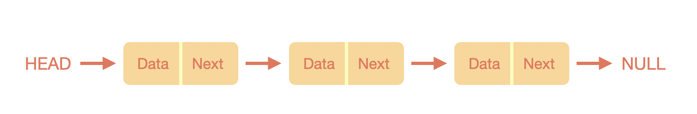
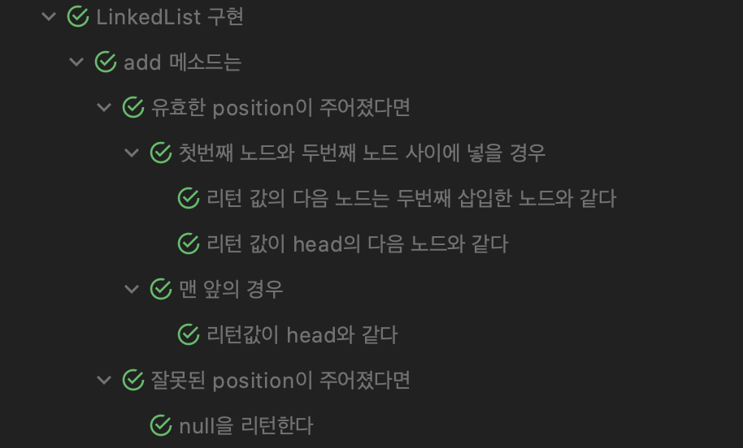
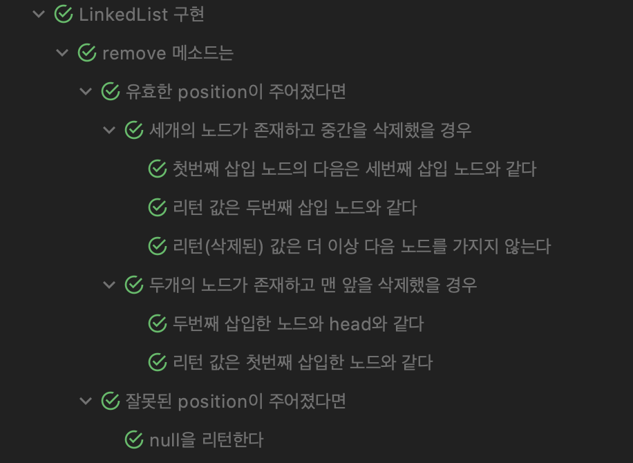

# LinkedList 구현하기

### 📖목표

> * LinkedList 공부하기
> * 정수를 저장하는 LinkedList 클래스 구현하기
>   * ListNode add(ListNode head, ListNode nodeToAdd, int position)
>   * ListNode remove(ListNode head, int postionToRemove)
>   * boolean contains(ListNode head, ListNode nodeToCheck)

<br>

## 🎞LinkedList

연결 리스트란, 배열과 비슷하게 데이터들의 묶음을 나타낼 때 사용하며 데이터와 데이터들을 직접적으로 연결하므로써 연관된 데이터들을 묶는다. 즉, 배열은 연속적인 공간 안에 데이터를 저장하고 이들의 위치를 통해 데이터에 접근했다면, 연결 리스트는 하나의 노드 안에 데이터와 그 다음 노드를 가리키는 주소 값을 가지고 있어 다음 노드로 탐색이 가능하다.



<p align="center" style="font-weight:bold">[ 연결 리스트 ]</p>

위 그림과 같이 데이터들을 사슬로 연결한 것과 같이 나타낼 수 있다. Data + Next(다음 노드 위치)를 하나로 묶고 이를 Node라고 한다. 즉, 하나의 노드에서 다음 노드의 위치를 또 그 다음 노드의 위치를 표시하여 꼬리에 꼬리를 무는 형태이다.

### 장점/단점

연결 리스트의 큰 장점은 메모리를 미리 할당하지 않아도 된다는 점이다. 즉, 크기를 늘리고 줄이는 부가적인 처리를 하지 않아도 되며, 데이터의 삽입과 삭제시에 `O(1)`이라는 시간에 가능하다. 반대로 임의 접근(Random Access)가 불가능하여 데이터를 검색하는데 `O(n)`이란 시간이 걸리게 된다. 이렇게 연결 리스트만의 장점이 존재하며, 삽입과 삭제가 많은 상황이나 전제적인 데이터의 크기를 파악할 수 없을 때 용이하게 사용할 수 있다.

### 종류

이러한 연결 리스트는 노드를 어떻게 구성하느냐에 따라 여러가지 형태로 만들 수 있다.

* 단순 연결 리스트

  > 위 그림과 같이 노드에서 다음 노드의 위치만 저장하는 형태

* 원형 연결 리스트

  > 마지막 노드의 다음 노드 위치를 `null`이 아닌 맨 처음 노드를 가리키게 하여 원형의 형태

  

* 이중 연결 리스트

  > 하나의 노드에 이전 노드와 다음 노드의 위치를 둘 다 저장하는 형태  
  > 단순 연결 리스트보다 탐색에 조금 더 자유로움

  

<br>

## 구현

기존 `ListNode` 클래스에서 `add`, `remove`, `contains` 메소드를 구현하는 것이 과제였으나, 하나의 노드 내부에 이들이 있는 것이 아니라 판단하고 임의대로 `LinkedList` 클래스를 하나 생성했다.  
따라서, `ListNode` 클래스에서는 데이터와 다음 노드를 가리키는 포인터만 존재하고 이들을 접근, 설정하는 메소드만 존재한다. 그리고 `LinkedList` 클래스에서 `add`, `remove`, `contains` 메소드를 구현하였다.

### ListNode

위 설명대로 `ListNode`는 데이터와 다음 노드를 가리키는 포인터만 존재하므로 인스턴스 변수로 `data`와 `next`를 가진다.

```java
public class ListNode {
	private int data;
    	private ListNode next;

    	ListNode(int data) {
		this.data = data;
    	}

	public int getData() {
		return this.data;
	}

	public ListNode getNext() {
		return this.next;
	}

	public void setNext(ListNode nextNode) {
		this.next = nextNode;
	}
}
```

중간에 값이 삽입/삭제/존재 여부만 알면 되므로 `data`는 변하지 않으므로 setter 함수는 만들지 않는다.

<br>

### LinkedList

```java
public class LinkedList {
	private ListNode head;
	private int size;

	LinkedList() {
		this.head = null;
		this.size = 0;
	}
}
```

`LinkedList`에서는 가장 맨 앞 노드만 가지고 있어도 되므로 인스턴스 변수로 `head`가 존재하고 `add`와 `remove` 메소드에서 `position`이 존재하기에 유효한 접근을 위해 `size`도 추가하였다.

### # add

삽입의 경우, 기본적으로 매개변수인 `position`이 유효한지 확인하고 해당 위치를 찾아가 그 사이에 새로운 노드(`nodeToAdd`)를 삽입한다.

```java
public ListNode add(ListNode nodeToAdd, int position) {
	// position의 유효성 체크를 위해 먼저 증감
	this.size++;

	// position 유효성 체크
	if(validatePositionRange(position)) {
	printPositionErr();
	return null;
	}

	// 해당 위치 찾기
	ListNode pre = null, cur = this.head;
	while(--position > 0) {
		pre = cur;
		cur = cur.getNext();
	}

  	// 삽입 위치가 맨 앞일 경우
	if(pre == null) {
		nodeToAdd.setNext(cur);
		this.head = nodeToAdd;
		return this.head;
	}

  	// 그 이외에 경우
  	pre.setNext(nodeToAdd);
	nodeToAdd.setNext(cur);
	return nodeToAdd;
}
```
<br>
### # remove

`remove` 또한, 위치로 찾기 때문에 유효성을 체크한다. 이후 `add` 똑같이 위치를 찾고 해당 위치의 노드를 삭제한다.

```java
public ListNode remove(int positionToRemove) {
	// positionToRemove 유효성 체크
	if(validatePositionRange(positionToRemove)) {
		printPositionErr();
		return null;
	}

	// 해당 위치 찾기
	ListNode pre = null, cur = this.head;
	while(--positionToRemove > 0) {
		pre = cur;
		cur = cur.getNext();
	}

	// 연결 리스트의 크기 감소
	this.size--;

	// 삭제 위치가 맨 앞일 경우
	if(pre == null) {
		this.head = cur.getNext();
		return cur;
	}

	// 그 이외의 경우
	pre.setNext(cur.getNext());
	return cur;
}
```
<br>
### # contains

`contains`의 경우 연결 리스트를 순회하면서 찾는 노드가 존재하는지 확인한다. `data`로 판단하면 중복된 노드가 존재할 수 있으므로 `ListNode` 객체로 판단한다.

```java
public boolean contains(ListNode nodeToCheck) {
	// 순회
	ListNode cur = this.head;
	while(cur != null) {
		// 같은 ListNode라면
		if(cur == nodeToCheck) {
			return true;
		}
		cur = cur.getNext();
	}
	// 끝까지 체크하고도 같은 ListNode가 없다면
	return false;
}
```

<br>

## 테스트

테스트의 경우 이전에 살펴보았던 D-C-I 패턴을 이용했으며, `add`, `remove`, `contains` 메소드만 테스트했다.

### # add

```java
@Nested
@DisplayName("add 메소드는")
class Describe_add{
	@Nested
	@DisplayName("잘못된 position이 주어졌다면")
	class Context_with_invalid_position {
		final int FIRST_NODE_VALUE = 10;
		final int INVALID_POSITION_INDEX = -1;

		@Test
		@DisplayName("null을 리턴한다")
		void it_returns_null() {
			LinkedList linkedList = new LinkedList();
			ListNode addedNode = linkedList.add(new ListNode(FIRST_NODE_VALUE), INVALID_POSITION_INDEX);
			assertNull(addedNode);
		}
	}

	@Nested
	@DisplayName("유효한 position이 주어졌다면")
	class Context_with_valid_position {
		@Nested
		@DisplayName("맨 앞의 경우")
		class Sub_context_with_front {
			final int FIRST_NODE_VALUE = 10;
			final int FIRST_POSITION_INDEX = 1;
			@Test
			@DisplayName("리턴값이 head와 같다")
			void it_returns_list_node_same_head() {
        			try {
          				LinkedList linkedList = new LinkedList();
          				ListNode frontNode = linkedList.add(new ListNode(FIRST_NODE_VALUE), FIRST_POSITION_INDEX);
          				Field headField = linkedList.getClass().getDeclaredField("head");
          				headField.setAccessible(true);
          				assertEquals(frontNode, headField.get(linkedList));
        			} catch (IllegalAccessException | NoSuchFieldException e) {
          				e.printStackTrace();
        			}
			}
    	}

	@Nested
    	@TestInstance(TestInstance.Lifecycle.PER_CLASS)
    	@DisplayName("첫번째 노드와 두번째 노드 사이에 넣을 경우")
    	class Sub_context_with_between_first_second {
      		final int FIRST_NODE_VALUE = 3;
      		final int SECOND_NODE_VALUE = 1;
      		final int BETWEEN_NODE_VALUE = 10;
 		final int FIRST_POSITION_INDEX = 1;
      		final int SECOND_POSITION_INDEX = 2;

      		LinkedList linkedList;
      		ListNode first, second, between, head;

      		@BeforeAll
      		void prepare_add_test() {
        		try {
          			linkedList = new LinkedList();
          			first = linkedList.add(new ListNode(FIRST_NODE_VALUE), FIRST_POSITION_INDEX);
          			second = linkedList.add(new ListNode(SECOND_NODE_VALUE), SECOND_POSITION_INDEX);
          			between = linkedList.add(new ListNode(BETWEEN_NODE_VALUE), SECOND_POSITION_INDEX);


          			Field headField = linkedList.getClass().getDeclaredField("head");
          			headField.setAccessible(true);
          			head = (ListNode) headField.get(linkedList);
        			} catch (IllegalAccessException | NoSuchFieldException e) {
          				e.printStackTrace();
        			}
			}

      			@Test
      			@DisplayName("리턴 값이 head의 다음 노드와 같다")
      			void it_returns_same_head_next() {
        			assertAll(
          				() -> assertEquals(head, first),
          				() -> assertNotEquals(second, head.getNext()),
          				() -> assertEquals(between, head.getNext())
        			);
      			}

      			@Test
      			@DisplayName("리턴 값의 다음 노드는 두번째 삽입한 노드와 같다")
      			void it_returns_same_second_add_node() {
        			assertEquals(between.getNext(), second);
      			}
    		}
 	}
}
```

`add` 메소드의 경우, 먼저 `position` 매개변수가 유효한지를 확인해보아야 하기 때문에 큰 범주로 넣어 두었다. 그 다음은 `position`이 유효할 경우, 노드의 삽입이 잘 되는지를 테스트한다. 이 때는 맨 앞에 삽입할 경우와 중간에 삽입할 경우로 나누어서 테스트 하였다.

#### 결과



<br>

### # remove

```java
@Nested
@DisplayName("remove 메소드는")
class Describe_remove {
  	@Nested
  	@DisplayName("잘못된 position이 주어졌다면")
 	class Context_with_invalid_position {
    		final int FIRST_NODE_VALUE = 10;
    		final int INVALID_POSITION_INDEX = -1;

    		@Test
    		@DisplayName("null을 리턴한다")
    		void it_returns_null() {
      			LinkedList linkedList = new LinkedList();
      			ListNode addedNode = linkedList.add(new ListNode(FIRST_NODE_VALUE), INVALID_POSITION_INDEX);
      			assertNull(addedNode);
    		}
  	}

  	@Nested
  	@TestInstance(TestInstance.Lifecycle.PER_CLASS)
  	@DisplayName("유효한 position이 주어졌다면")
  	class Context_with_valid_position {
    		final int FIRST_NODE_VALUE = 3;
    		final int SECOND_NODE_VALUE = 1;
    		final int THIRD_NODE_VALUE = 10;
    		final int FIRST_POSITION_INDEX = 1;
    		final int SECOND_POSITION_INDEX = 2;
    		final int THIRD_POSITION_INDEX = 3;

    		@Nested
    		@TestInstance(TestInstance.Lifecycle.PER_CLASS)
    		@DisplayName("두개의 노드가 존재하고 맨 앞을 삭제했을 경우")
    		class Sub_context_with_front_remove {
      			ListNode first, second, removed, head;

      			@BeforeAll
      			void prepare_remove_front_node() {
        			try {
          				LinkedList linkedList = new LinkedList();
          				first = linkedList.add(new ListNode(FIRST_NODE_VALUE), FIRST_POSITION_INDEX);
          				second = linkedList.add(new ListNode(SECOND_NODE_VALUE), SECOND_POSITION_INDEX);
          				removed = linkedList.remove(FIRST_POSITION_INDEX);

          				Field headField = linkedList.getClass().getDeclaredField("head");
          				headField.setAccessible(true);
          				head = (ListNode) headField.get(linkedList);
        			} catch (IllegalAccessException | NoSuchFieldException e) {
          				e.printStackTrace();
				}
      			}

      			@Test
      			@DisplayName("리턴 값은 첫번째 삽입한 노드와 같다")
      			void it_returns_same_first_add_node() {
        			assertEquals(first, removed);
      			}

      			@Test
      			@DisplayName("두번째 삽입한 노드와 head와 같다")
      			void it_second_add_node_same_head() {
        			assertEquals(second, head);
      			}
    		}

    		@Nested
    		@TestInstance(TestInstance.Lifecycle.PER_CLASS)
    		@DisplayName("세개의 노드가 존재하고 중간을 삭제했을 경우")
    		class Sub_context_with_between_first_to_second_remove {
      			ListNode first, second, third, removed;

      			@BeforeAll
      			void prepare_remove_between_node() {
        			LinkedList linkedList = new LinkedList();
        			first = linkedList.add(new ListNode(FIRST_NODE_VALUE), FIRST_POSITION_INDEX);
        			second = linkedList.add(new ListNode(SECOND_NODE_VALUE), SECOND_POSITION_INDEX);
        			third = linkedList.add(new ListNode(THIRD_NODE_VALUE), THIRD_POSITION_INDEX);
        			removed = linkedList.remove(SECOND_POSITION_INDEX);
      			}

      			@Test
      			@DisplayName("리턴 값은 두번째 삽입 노드와 같다")
      			void it_return_second_node() {
        			assertEquals(removed, second);
      			}

      			@Test
      			@DisplayName("리턴(삭제된) 값은 더 이상 다음 노드를 가지지 않는다")
      			void it_returns_remove_next_node() {
        			assertNotEquals(removed.getNext(), third);
      			}

      			@Test
      			@DisplayName("첫번째 삽입 노드의 다음은 세번째 삽입 노드와 같다")
      			void it_first_node_same_second_node() {
        			assertAll(
          				() -> assertEquals(first.getNext(), third),
          				() -> assertNotEquals(first.getNext(), second)
        			);
      			}
    		}
  	}
}
```

`remove` 메소드는 `add`와 거의 동일한 제약 조건을 가지고 있으므로 큰 범주는 비슷하다.

#### 결과



<br>

### # contains

```java
@Nested
@TestInstance(TestInstance.Lifecycle.PER_CLASS)
@DisplayName("contains 메소드는")
class Describe_contains {
  	final int FIRST_NODE_VALUE = 3;
  	final int SECOND_NODE_VALUE = 1;
  	final int THIRD_NODE_VALUE = 10;
  	final int NOT_CONTAINS_NODE_VALUE = -3;
  	final int FIRST_POSITION_INDEX = 1;
  	final int SECOND_POSITION_INDEX = 2;
  	final int THIRD_POSITION_INDEX = 3;

  	LinkedList linkedList;
  	ListNode first, second, third, contains, notContains;

  	@BeforeAll
  	void prepare_contains_test() {
    		linkedList = new LinkedList();
    		first = linkedList.add(new ListNode(FIRST_NODE_VALUE), FIRST_POSITION_INDEX);
    		second = linkedList.add(new ListNode(SECOND_NODE_VALUE), SECOND_POSITION_INDEX);
    		third = linkedList.add(new ListNode(THIRD_NODE_VALUE), THIRD_POSITION_INDEX);
    		contains = first;
    		notContains = new ListNode(NOT_CONTAINS_NODE_VALUE);
  	}

  	@Nested
  	@DisplayName("연결 리스트에 존재하는 노드가 주어질 경우")
  	class Context_with_contains {
    		@Test
    		@DisplayName("참을 리턴한다")
    		void it_returns_true() {
      			boolean isContains = linkedList.contains(contains);
      			assertTrue(isContains);
    		}
  	}

  	@Nested
  	@DisplayName("연결 리스트에 존재하지 않는 노드가 주어질 경우")
  	class Context_with_not_contains {
    		@Test
    		@DisplayName("거짓을 리턴한다")
    		void it_returns_false() {
      			boolean isNotContains = linkedList.contains(notContains);
      			assertFalse(isNotContains);
    		}
  	}
}
```

`contains`의 경우엔 연결 리스트에 존재하냐 안하냐의 체크만 해주면 된다.

#### 결과


