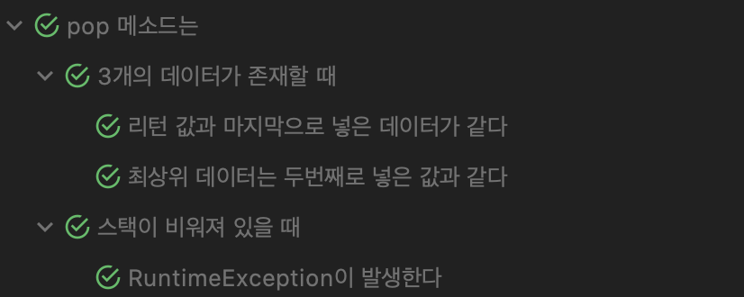

# Stack

### 📖목표

> * int 배열을 사용해서 정수를 저장하는 Stack을 구현
>   * void push(int data) 구현
>   * int pop() 구현
> * 앞서 만든 ListNode를 가지고 Stack을 구현
>   * ListNode head를 가지고 있는 ListNodeStack 클래스 구현
>   * void push(int data) 구현
>   * int pop() 구현

<br>

## 🗄Stack이란?

구현을 하기 전 Stack에 대해 간단히 알아보도록 하자.  
Stack은 FILO(First In Last Out)이란 특징을 가지고 있는 자료구조이다.  
즉, 첫번째로 들어간(push) 것은 제일 마지막에 꺼낼(pop) 수 있다.

<br>

## 배열을 이용한 구현

배열을 사용하므로 고정된 크기만큼 데이터를 저장할 수 있기 때문에 원하는 크기를 설정할 수 있거나 기본적으로 설정된 크기(10개)를 사용할 수 있다.

```java
public class ArrayStack {
	private final int[] store;
	private final int maxSize;
	private int size;

	ArrayStack() {
		final int DEFAULT_SIZE = 10;
		this.store = new int[DEFAULT_SIZE];
		this.maxSize = DEFAULT_SIZE;
		this.size = 0;
	}

	ArrayStack(int maxSize) {
		this.store = new int[maxSize];
		this.maxSize = maxSize;
		this.size = 0;
	}
}
```

따라서 매개 변수가 없는 생성자와 최대 크기를 받는 생성자를 나누어 만들었다.

### # push

```java
public void push(int data) {
	if (isFull()) {
		throw new RuntimeException("Stack is full...");
	}
	this.store[this.size++] = data;
}
```

Java Collections에서의 `Stack`에서는 동적으로 크기가 커지지만, 여기서는 최대 크기를 정해 놨으므로 `push`시에 데이터 크기가 넘어가는지 확인을 해야한다.

### # pop

```java
public int pop() {
	if(isEmpty()) {
		throw new RuntimeException("Stack is Empty...");
	}
	return this.store[--this.size];
}
```

컬렉션즈에 있는 `Stack`에서는 비어있는 스택에서 `pop`시 `EmptyStackException`가 발생한다. 이는 `RuntimeException`을 상속받은 것이므로 여기서는 `RuntimeException`을 사용하였다.

<br>

## 배열을 이용한 스택 테스트

주요 메소드인 `push`와 `pop` 과 생성자 테스트를 진행하였다.

### # constructor

생성자에서는 인자를 주었는가로 범주를 나누어 테스팅을 한다.

```java
@Nested
@DisplayName("생성자는")
class Describe_constructor {
	private int getMaxSizeFromStack(ArrayStack stack) {
		try{
			Field maxSize = stack.getClass().getDeclaredField("maxSize");
			maxSize.setAccessible(true);
			return (int) maxSize.get(stack);
		}catch (NoSuchFieldException | IllegalAccessException e) {
			e.printStackTrace();
		}
		return -1;
	}

	@Nested
	@DisplayName("아무 인자를 주지 않았다면")
	class Context_with_no_param {
		@Test
  		@DisplayName("크기가 10인 스택이 생성된다")
  		void it_created_stack_size_ten() {
    			final int DEFAULT_STACK_SIZE = 10;
    			ArrayStack stack = new ArrayStack();
    			int maxSize = getMaxSizeFromStack(stack);
    			assertEquals(maxSize, DEFAULT_STACK_SIZE);
  		}
	}

	@Nested
	@DisplayName("인자를 주었다면")
	class Context_with_param {
   		@Test
    		@DisplayName("준 인자 크기의 스택이 생성된다")
    		void it_created_stack_size_ten() {
      			final int MAX_STACK_SIZE = 20;
      			ArrayStack stack = new ArrayStack(MAX_STACK_SIZE);
      			int maxSize = getMaxSizeFromStack(stack);
      			assertEquals(maxSize, MAX_STACK_SIZE);
    		}
  	}
}
```

#### 결과


### # push

`push` 메소드는 스택이 꽉 찼을 경우 `RuntimeException`을 발생시키는지, 들어간 데이터 순서와 크기가 어떻게 되는지에 대해 테스트를 진행했다.

```java
@Nested
@DisplayName("push 메소드는")
class Describe_push {

	@Nested
  	@DisplayName("스택이 꽉 찬 상태라면")
  	class Context_with_stack_full {
    		ArrayStack stack;

    		@BeforeEach
    		void prepare() {
      			final int STACK_SIZE = 5;
      			stack = new ArrayStack(STACK_SIZE);
      			for(int i = 1; i <= STACK_SIZE; i++) {
        			stack.push(i);
      			}
    		}

    		@Test
    		@DisplayName("RuntimeException이 발생한다")
    		void it_occurs_runtime_exception() {
      			final int RANDOM_DATA = 10;
      			assertThrows(RuntimeException.class, () -> stack.push(RANDOM_DATA));
    		}
  	}

  	@Nested
  	@TestInstance(TestInstance.Lifecycle.PER_CLASS)
  	@DisplayName("3개의 데이터가 들어갔을 때")
  	class Context_with_three_data_push {
    		final int FIRST_DATA = 3;
    		final int SECOND_DATA = 10;
    		final int THIRD_DATA = -20;
    		final int STACK_SIZE = 3;
    		ArrayStack stack;

    		@BeforeAll
    		void prepare() {
      			stack = new ArrayStack();
      			stack.push(FIRST_DATA);
      			stack.push(SECOND_DATA);
      			stack.push(THIRD_DATA);
    		}

    		@Test
    		@DisplayName("최상위 데이터는 세번째 데이터와 같다")
    		void it_top_data_same_third_data() {
      			try {
        			Field store = stack.getClass().getDeclaredField("store");
        			store.setAccessible(true);
        			Field size = stack.getClass().getDeclaredField("size");
        			size.setAccessible(true);
        			int topData = ((int[]) store.get(stack))[(int) size.get(stack) - 1];
        			assertEquals(topData, THIRD_DATA);
      			} catch (NoSuchFieldException | IllegalAccessException e) {
        			e.printStackTrace();
      			}
    		}

    		@Test
    		@DisplayName("스택 크기는 3이다")
    		void it_stack_size_three() {
      			try {
        			Field size = stack.getClass().getDeclaredField("size");
        			size.setAccessible(true);
        			assertEquals(size.get(stack), STACK_SIZE);
      			} catch (NoSuchFieldException | IllegalAccessException e) {
        			e.printStackTrace();
      			}
    		}
  	}
}
```

#### 결과


### # pop

`pop` 또한 스택이 비워져 있을시에 `RuntimeException`을 발생시키는지 그리고 여러 데이터가 존재할 때 메소드 실행 후에 데이터들과 리턴 값에 대해 테스트를 진행했다.

```java
@Nested
@DisplayName("pop 메소드는")
class Describe_pop {
  	@Nested
  	@DisplayName("스택이 비워져 있을 때")
  	class Context_with_stack_empty {
    		@Test
    		@DisplayName("RuntimeException이 발생한다")
    		void it_occurs_runtime_exception() {
      			ArrayStack stack = new ArrayStack();
      			assertThrows(RuntimeException.class, stack::pop);
    		}
  	}
  	@Nested
  	@DisplayName("3개의 데이터가 존재할 때")
  	class Context_with_exist_three_data {
    		final int FIRST_DATA = 3;
    		final int SECOND_DATA = 10;
    		final int THIRD_DATA = -20;
    		ArrayStack stack;

		@BeforeEach
    		void prepare() {
      			stack = new ArrayStack();
      			stack.push(FIRST_DATA);
      			stack.push(SECOND_DATA);
      			stack.push(THIRD_DATA);
    		}

    		@Test
    		@DisplayName("리턴 값과 마지막으로 넣은 데이터가 같다")
    		void it_returns_same_last_push_data() {
      			int popped = stack.pop();
      			assertEquals(popped, THIRD_DATA);
    		}

    		@Test
    		@DisplayName("최상위 데이터는 두번째로 넣은 값과 같다")
    		void it_top_data_same_second_data() {
      			stack.pop();
      			try {
        			Field store = stack.getClass().getDeclaredField("store");
        			store.setAccessible(true);
        			Field size = stack.getClass().getDeclaredField("size");
        			size.setAccessible(true);
        			int topData = ((int[])store.get(stack))[(int)size.get(stack) - 1];
        			assertEquals(topData,SECOND_DATA);
      			} catch (NoSuchFieldException | IllegalAccessException e) {
        			e.printStackTrace();
      			}
    		}
  	}
}
```

#### 결과



<br>

## ListNode를 이용한 구현

기존에 구현했던[ `ListNode` 클래스](week4_2.md)는 단순히 `data`, `next`만 가지고 있기에 `add`와 `remove`, `contains`를 추가했다.

### # ListNode

```java
public class ListNode {
	final static int POSITIVE_NUM_STAND = 0;

	private int data;
  	private ListNode next;

  	ListNode(int data) {
    		this.data = data;
    		this.next = null;
  	}

  	public int getData() {
    		return this.data;
  	}

  	public ListNode getNext() {
    		return this.next;
  	}

  	public ListNode add(ListNode head, ListNode nodeToAdd, int position) {
    		Pair<ListNode, ListNode> foundNodes = findListNodePosition(head, position);
    		ListNode pre = foundNodes.first, cur = foundNodes.second;

    		pre.next = nodeToAdd;
    		nodeToAdd.next = cur;
    		return nodeToAdd;
  	}

  	public ListNode remove(ListNode head, int positionToRemove) {
    		Pair<ListNode, ListNode> foundNodes = findListNodePosition(head, positionToRemove);
    		ListNode pre = foundNodes.first, cur = foundNodes.second;

    		pre.next = cur.next;
    		cur.next = null;
    		return cur;
    	}

  	public boolean contains(ListNode head, ListNode nodeToCheck) {
    		ListNode cur = head;
    		while(cur != null) {
      			if(cur == nodeToCheck) return true;
      			cur = cur.next;
    		}
    		return false;
  	}

  	private Pair<ListNode, ListNode> findListNodePosition(ListNode head, int position) {
    		if(position <= POSITIVE_NUM_STAND) throw new RuntimeException("Position is positive number");

    		ListNode pre = null, cur = head;
    		while(position-- > 0) {
      			try {
        			pre = cur;
        			cur = cur.next;
	      		} catch (NullPointerException e) {
        			throw new RuntimeException("Position too big");
      			}
    		}
    		return Pair.add(pre, cur);
  	}
}
```

마지막 `findListNodePosition` 메소드는 삽입 혹은 삭제될 공간(node와 node 사이)이 어디인지 알려준다.

### # constructor

`ArrayStack` 과 동일

### # push

```java
public void push(int data) {
	if(isFull()) throw new RuntimeException("Stack is full...");
	ListNode added = new ListNode(data);
  	if(this.head == null) {
    		this.head = added;
  	}else {
    		this.head.add(this.head, added, this.size);
  	}
  	this.size++;
}
```

배열과는 다르게 하나의 `ListNode`(head)가 연결 되어있기 때문에 처음 삽입되었을 때 따로 할당해주어야 한다.

### # pop

```java
public int pop() {
	if(isEmpty()) throw new RuntimeException("Stack is Empty...");
	int removed;
	if(this.size == 1) {
		removed = this.head.getData();
    		this.head = null;
    		this.size--;
  	}else {
    		removed = this.head.remove(this.head, --this.size).getData();
  	}
  	return removed;
}
```

처음 삽입시 따로 할단해준 것 처럼 마지막 노드를 빼내었을 때 따로 `head`를 null로 할당한다. `pop`의 경우, 빼낸 데이터 값을 반환하므로 따로 저장해주고 이를 반환한다.

<br>

## ListNode를 이용한 스택 테스트

`ArrayStack` 테스트와 동일하다.
