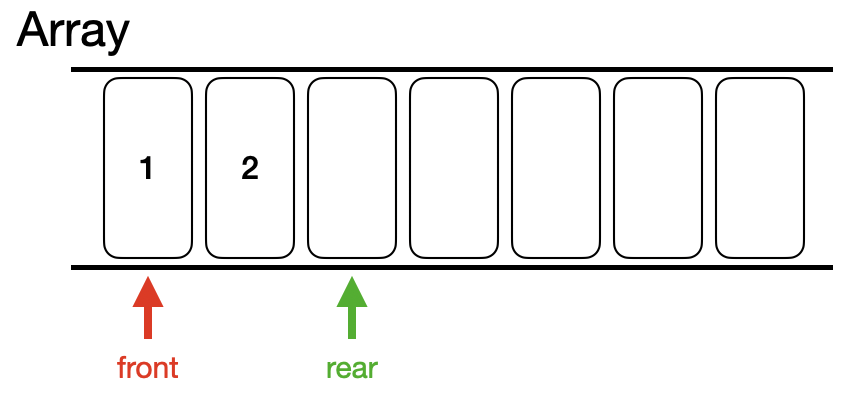
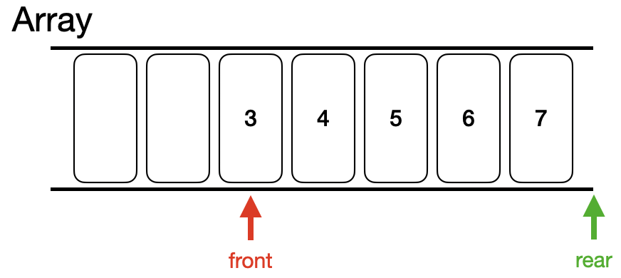
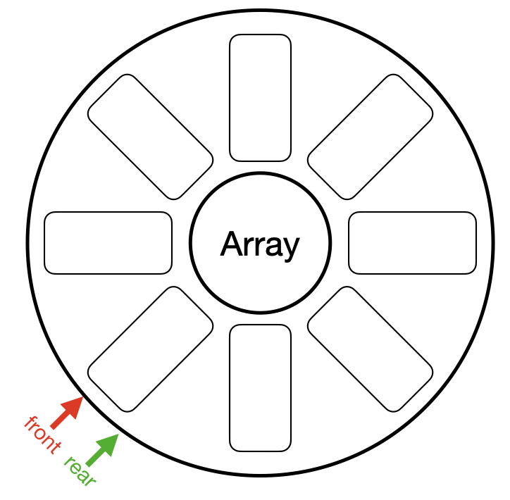
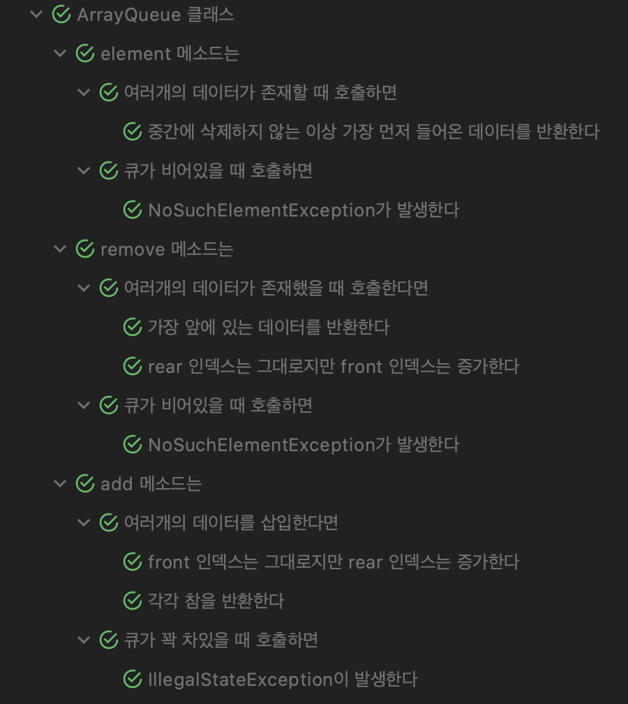
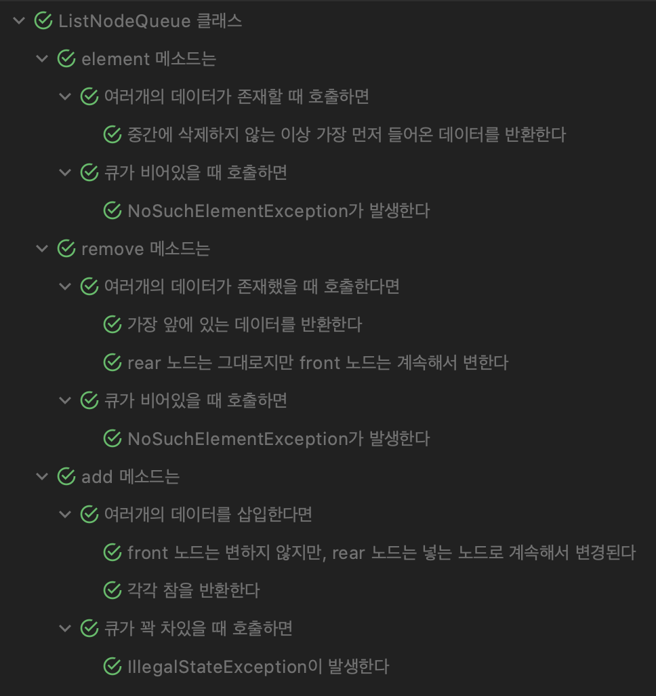

# Queue

### 📖목표

> * 배열을 사용하여 Queue 구현
> * ListNode를 사용하여 Queue 구현

<br>

## 🚇 Queue란?

Queue 라는 자료구조는 무엇일까?  
간단하게 설명하자면, Queue는 Stack과 달리 FIFO(First In Frist Out)으로 데이터들을 관리한다.  
즉, 터널을 지나는 전철과 같이 처음으로 들어간 칸이 처음으로 터널을 빠져나오는 것과 같다고 생각하면 된다.

<br>

## 배열을 이용한 구현

삽입에서는 Stack과 같기때문에 상관 없지만, 삭제에서는 앞쪽에서 데이터를 뽑아내기에 다른식으로 구현을 해야한다.  
이전 Stack에서도 직접 배열의 데이터를 지우지 않고 인덱스(가장 위쪽을 가리키는)를 사용하여 효율성을 높혔다.

Queue도 마찬가지로 삭제할 때마다 새로운 배열을 만들고 데이터를 하나씩 앞으로 옮기는 것은 성능상 좋지 못할 것이다.  
따라서 인덱스 두개를 둘 것인데, 하나는 앞(front)을 가리키고 나머지 하나는 뒤(rear)를 가리킬 것이다.  

<p align="center"></p>

위 그림은 최대 7개까지 저장할 수 있는 배열을 사용한 Queue를 보여준다.  
즉, 삽입시에는 rear 위치에 데이터를 저장하고 rear를 증가 시키는 것이다.  
이렇게 구현을 한다면 삽입에서는 문제가 없지만 삭제에서 문제가 생긴다.

<p align="center"></p>

위 그림은 3,4,5,6,7를 추가하고 데이터를 2번 꺼낸 것이다.(1, 2 삭제)  
그림에서는 1,2를 삭제했다는 의미에서 숫자를 없앴지만, 현실에서는 front만 움직인 것이다.

이 상태는 Queue가 꽉 찬 상태가 아니기에 데이터를 삽입할 수 있다.  
단순하게 5개의 데이터를 앞으로 댕기면 될 수도 있지만, 이는 성능상에서 좋지 않다.

그렇기 때문에 front와 rear를 배열에서 벗어난 값을 가리키게 하는 것이 아닌 배열의 맨 앞으로 보내는 것이다.  
즉, 환형 배열을 사용하여 추가적인 연산없이 배열을 효율적으로 사용하는 것이다.

<p align="center"></p>

이해하기 쉽게 그린 그림이며, 똑같은 배열을 사용한다.  
다른 점은 인덱스를 증가시킬때 배열 크기만큼 나머지 연산자를 사용하여 배열을 벗어나지 못하게 하는것이다.

또한, 기존 배열보다 하나의 빈 공간을 만들어야한다.  
이는 모든 공간에 데이터를 넣는다면 이 Queue가 비어있는지 꽉 차있는지를 확인하는 로직을 추가해야하기 때문이다.

삽입시에는 똑같이 rear를 증가시키고 데이터를 넣어야 한다.  
주의할 점은 다음 넣을 위치가 front가 존재하는지 확인해야 한다는 것이다.  
바로 다음에 front 인덱스가 존재한다면 Queue가 꽉 차있다는 것이기 때문이다.

삭제할 때는 front의 위치만 증가시켜주면 된다.  
여기서 주의할 점은 빈 Queue(front와 rear가 같을 때)에서는 삭제할 수 없다는 점이다.

이러한 환형 배열을 가지고 Queue를 구현해 보자.

<br>

## 환형 배열 기반 Queue 구현

> Java Collections에 존재하는 Queue를 참고하여 add, remove, element 메소드 구현

먼저 Queue 안에는 데이터를 저장할 공간, front/rear 인덱스, 저장 공간 크기를 가지고 있어야 한다.

```java
public class ArrayQueue {
    private int[] entries;
    private int maxSize;
    private int front;
    private int rear;
}
```

따라서 Queue에 다음과 같은 4개의 인스턴스 변수를 선언한다.

### # add

```java
public boolean add(int data) {
	if(isFull()) throw new IllegalStateException("Queue is full...");
	this.rear = (this.rear + 1) % this.maxSize;
	this.entries[this.rear] = data;
	return true;
}
```

앞서 설명한대로 rear의 위치를 다음으로 옮기고 이 공간에 데이터를 저장하며 성공시 `true`를 반환한다.  
꽉 찬 상태에서 데이터를 추가하려면 `IllegalStateException`을 발생시킨다.

### # remove

```java
public int remove() {
	if(isEmpty()) throw new NoSuchElementException("Queue is empty...");
  int removed = element();
  this.front = (this.front + 1) % this.maxSize;
  return removed;
}
```

Queue가 빈 상태에서는 제거할 수 없으므로 `NoSuchElementException`을 발생시킨다.  
데이터가 존재한다면 가장 앞에 있는 데이터를 불러오고 front 인덱스를 늘린다.  
반환 값은 삭제된 값이므로 미리 저장해 둔다.

### # element

```java
public int element() {
	if(isEmpty()) throw new NoSuchElementException("Queue is empty...");
	return this.entries[(this.front + 1) % this.maxSize];
}
```

Queue가 빈 상태에서는 데이터가 존재하지 않으므로 `remove` 메소드와 똑같이 `NoSuchElementException`을 발생시킨다.  
데이터가 있을 시에는 가장 앞에 있는 데이터(front + 1 위치에 존재)를 반환한다.

<br>

## 환형 배열 기반 Queue 테스트

구현이 끝났으니 이가 맞는지 확인을 해보아야 한다.  
살짝 귀찮은 작업이지만 꼭 필요한 것이니 계속해서 익혀보자!

테스트는 우리가 구현한 `add`, `remove`, `element` 메소드를 해볼 것이다.  
테스트 코드가 길어 [링크](https://github.com/jongnan/Java_Study_With_Whiteship/blob/master/week4/assignment_5/src/test/java/ArrayQueueTest.java)를 걸어 두니 참고하길 바란다.

#### 결과

<p align="center"></p>

<br>

## ListNode 기반 Queue 구현

> `ListNode` 클래스는 [여기서](https://github.com/jongnan/Java_Study_With_Whiteship/blob/master/week4/assignment_5/src/main/java/ListNode.java) 확인할 수 있다.

연결 리스트의 특성상 마지막 노드로 탐색하는 시간이 생길 수 밖에 없다.  
따라서, Queue의 맨 앞 노드와 맨 뒤 노드 그리고 현재 크기, 최대 크기를 인스턴스 변수로 설정하였다.

```java
public class ListNodeQueue {
    private ListNode front;
    private ListNode rear;
    private final int maxSize;
    private int size;
}
```

### # add

```java
public boolean add(int data) {
	if(isFull()) throw new IllegalStateException("Queue is full...");
	ListNode addedNode = new ListNode(data);
	if(this.front == null) {
		this.front = addedNode;
	}else {
		this.rear.add(this.rear, addedNode, 1);
	}
	this.rear = addedNode;
	this.size++;
	return true;
}
```

데이터 삽입에서는 맨 뒤의 노드에 추가만 하면되므로 rear 노드 기준으로 데이터를 삽입하며 rear 노드를 항상 갱신한다.  
하지만, 처음엔 두 노드가 `null`로 되어있기에 이는 따로 할당해주어야 한다.

### # remove

```java
public int remove() {
	if(isEmpty()) throw new NoSuchElementException("Queue is empty...");
	ListNode removedNode = this.front;
	if(this.front == this.rear) {
		this.front = null;
		this.rear = null;
		this.size = 0;
		return removedNode.getData();
	}
	this.front = removedNode.getNext();
	this.size--;
	return removedNode.getData();
}
```

만약 front 노드와 rear 노드가 같다면 Queue 안에 한개의 데이터만 존재하므로 front, rear를 `null`로 할당한다.  
그 외에는 front 노드만 다음 노드로 할당해주면 된다.

### # element

```java
public int element() {
	if(isEmpty()) throw new NoSuchElementException("Queue is empty...");
	return this.front.getData();
}
```

항상 front 노드를 가지고 있으므로 해당 노드의 데이터만 반환하면 된다.

<br>

## ListNode 기반 Queue 테스트

Array 기반 큐와 비슷하며, 이 또한 코드가 기므로 [여기서](https://github.com/jongnan/Java_Study_With_Whiteship/blob/master/week4/assignment_5/src/test/java/ListNodeQueueTest.java) 확인하길 바란다.

#### 결과

<p align="center"></p>

