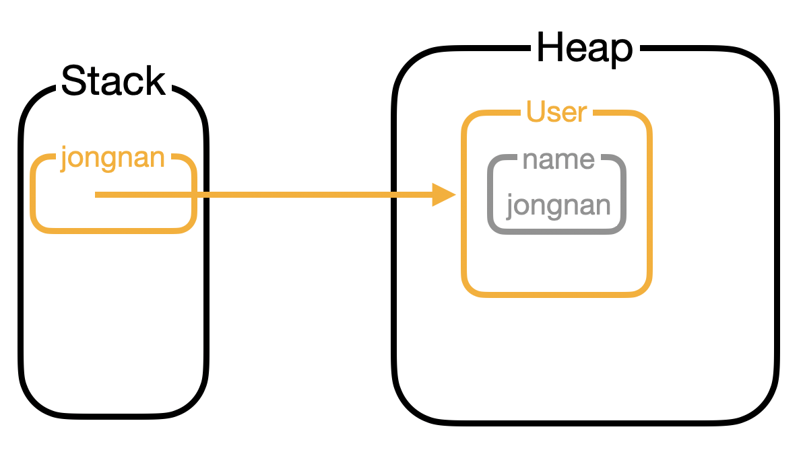

# Class

### 📖목표

> Class에 대해 학습해 보자

<br>

## 🗺 Class?

클래스란, 객체(Object)를 만들어 낼 때 설계도와 같은 개념으로 생각하면 쉽다. 즉, 계산기라는 객체를 생성하기 위해서는 계산기라는 클래스를 먼저 선언하고 그 안에 상태와 행위들을 작성을 해야하는 것이다.

### Object..?

객체는 무엇일까? 많이들 객체를 설명할 때 '**실세계에 있는 물체(사물)들을 투영한 것**'이라고 한다. 이 반대로 '객체지향의 사실과 오해 - 조영호' 에서는 객체는 **프로그래머가 설계한 새로운 세계(프로그램) 안에 새롭게 창조된 것**이라고 말한다. 이처럼 자신만의 생각을 가지고 객체를 정의하지만 공통적인 점은 하나 혹은 그 이상의 역할을 가진 하나의 단위를 나타낸다는 것이다.

### Instance..?

객체를 가리킬 때 '**Instance**'라고도 많이 부르는 것을 알 수 있다. 이는 클래스와는 다른 의미로 사용된다. 클래스가 객체의 설계도로 아직 메모리에 할당되지 않다면, 인스턴스는 객체를 생성하여 메모리가 할당되어 있는 상태라고 할 수 있다. 따라서 클래스를 통해 객체를 생성하는 것을 '**인스턴스화**' 라고 부른다.

<br>

## 클래스 정의하기

클래스를 선언하는 것은 `class` 키워드를 통해 간단하게 할 수 있다.

```java
[접근 제어자] class [이름] {
  // 필드
  
  // 생성자
  
  // 메소드
}
```

접근 제어자를 통해 객체 접근을 통제할 수 있다. 이름은 보통 대문자로 시작하며, 복합 단어일경우 단어마다 대문자를 사용하는 파스칼 케이스(ex - PascalCase)로 작성(이는 Naming 규칙을 검색해보는 것이 좋음)한다. 또한, 클래스 내부에는 필드(변수), 생성자(constructor), 메소드들을 정의할 수 있다.

보통 하나의 java 파일 안에 하나의 클래스만 정의하는 것이 좋지만, 여러개의 클래스를 선언할 수 있다. 여러개의 클래스가 존재할 때 컴파일을 하게 되면 선언한 클래스 수만큼 파일(.class)이 생성된다.

```java
// 컴파일 전
// Main.java
class Main {
  ...
}

class User {
  ...
}

// 컴파일 후
// Main.class, User.class
```

<br>

## 객체 만들기(new)

클래스를 인스턴스화 하는 방법은 `new` 키워드를 사용하는 것이다.

```java
User jongnan = new User("jongnan");
```

위의 코드와 같이 `User`라는 객체 이름으로된 타입을 선언 후에 `new` 키워드와 `=`(할당 연산자)를 통해 변수 안에 객체를 할당할 수 있다. 객체의 경우 원시 타입이 아니기 때문에 JVM의 heap 영역에 생성이 되며 stack 영역에서는 해당 객체의 주소값만 가지고 있게 된다.

<p align="center"></p>

<br>

## 필드

클래스의 멤버로 필드가 존재하는데 이는 객체의 상태(속성)을 나타내기 위함이다. 예를들면, `Human`라는 객체는 `name`, `age` 등 그 사람을 표현할 수 있는 여러가지 속성이 존재하는데 이를 필드에 선언할 수 있다. 이러한 필드에는 클래스 변수와 인스턴스 변수로 나눌 수 있다.

* 클래스 변수

  > `static` 키워드를 사용하여 선언  
  > 클래스가 로딩될 때 바로 메로리에 할당  
  > 해당 클래스로 생성된 객체들이 공용으로 사용 가능

* 인스턴스 변수

  > 변수 선언하듯이 선언  
  > 인스턴스 별로 따로 공간이 할당

<br>

## 생성자

생성자는 말 그대로 객체가 생성시에 어떠한 행동을 할지에 대해 정의하는 것이다. 해당 객체의 인스턴스 변수들을 초기화하는 역할으로 사용된다. 이러한 생성자를 선언하기 위해서는 메소드와 비슷하게 선언하지만 몇가지 제약조건이 존재한다.

* 이름은 클래스의 이름과 동일
* 반환값이 없음
* 초기화를 하기 위해 데이터 전달 가능(파라미터 존재 가능)
* 오버로딩 가능

```java
class [이름] {
  
  [이름]() {
    ...
  }
  //오버로딩
  [이름](인자 1, 인자 2...) {
    ...
  }
}
```

객체를 생성시 즉 `new` 키워드를 사용할 때 정의된 생성자가 호출되게 된다. 생성자를 작성하지 않아도 컴파일혹은 런타임에서 에러가 존재하지 않는데 이는 컴파일러가 기본 생성자를 자동으로 선언하기 때문이다.

```java
[클래스 이름](){}
```

이렇게 자동으로 선언된 기본 생성자는 아무런 파라미터 혹은 명령을 가지고 있지 않다.

<br>

## 메소드

필드가 객체의 상태를 나타내기 위함이면 메소드는 객체의 행위를 정의하는 것이다. 중복되는 코드를 하나의 객체의 메소드로 정의하여 가독성을 높히고 문제 발생시에 손쉽게 처리하기 위함으로 사용한다. 반환 타입을 지정할 수 있고, 매개변수도 받을 수 있으며 오버로딩 또한 가능하다.

```java
[접근 제어자] [반환 타입] 메소드 이름 (매개 변수) {
  ...
}
```

메소드 또한 필드와 같이 `static` 키워드를 통해 클래스 메소드를 선언할 수 있다. 클래스 변수와 같이 클래스가 로드될 때 메모리를 할당 받으며 객체를 생성하지 않아도 바로 접근하여 사용이 가능하다.

### 호출

`static` 키워드로 정의된 메소드의 경우, 다음과 같이 바로 사용이 가능하다.

```java
String name = User.getName();
```

일반적인 인스턴스 메소드의 경우, 객체를 생성하여 멤버 참조 연산자(`.`)를 사용하여 호출이 가능하다.

```java
User jongnan = new User("jongnan");
String name = jongnan.getName();
```

<br>

## this란?

this는 인스턴스화 된 객체 자기 자신을 참조하는 변수이다. 즉, 클래스 내부의 멤버들에 접근하기 위해서 this를 사용한다. 하지만 모두 접근이 가능한 것은 아니다. 앞서 this는 인스턴스화 된 자기 자신을 나타낸다 했기에  `static`으로 선언된 클래스 변수 혹은 메소드에서는 this로 접근이 불가능하다.

```java
class User {
  private static String type = "Human";
  private String name;
  
  User(String name) {
    this.name = name;	// this를 통해 매개변수와 인스턴스 변수를 구분
  }
  
  public static String getType() {
    return this.type; // 에러
  }
}
```

<br>

---

### Reference

* [TCPSchool - class, method&constructor](http://www.tcpschool.com/java/java_class_intro)

