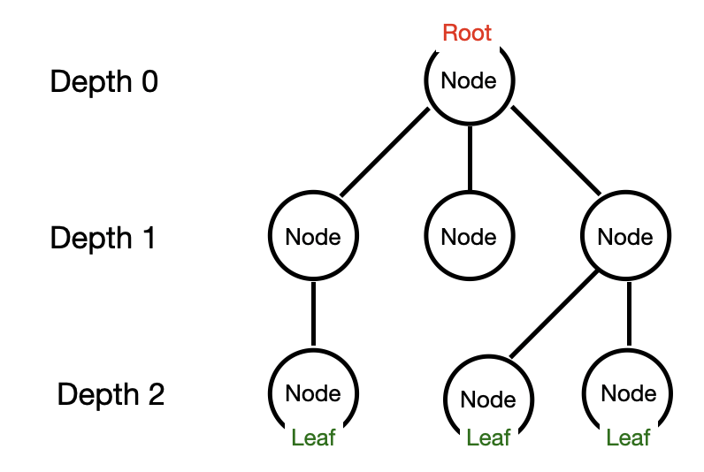
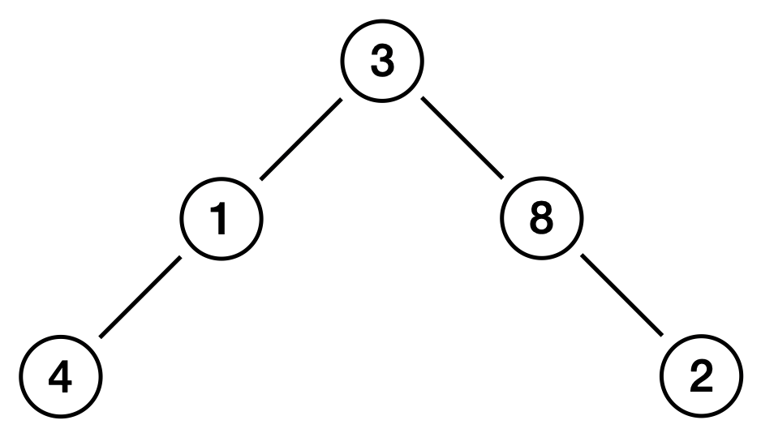
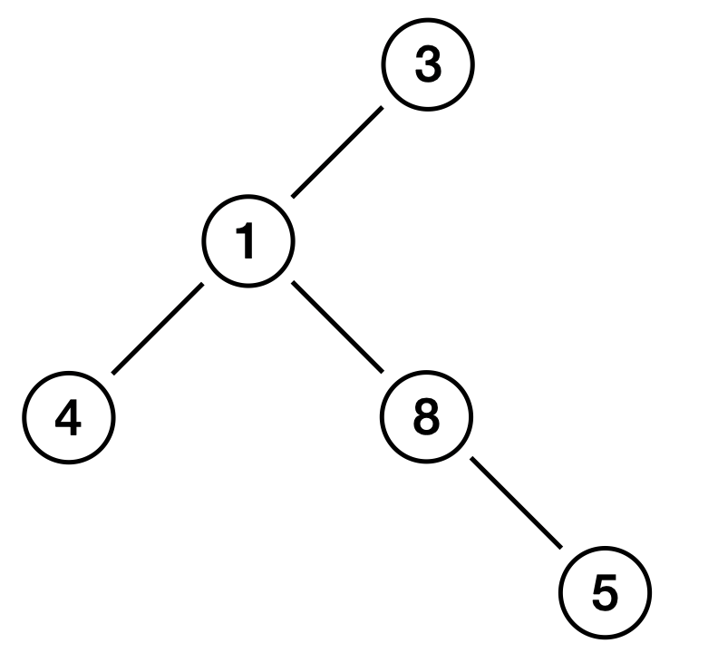
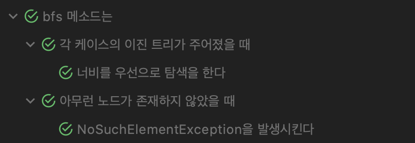
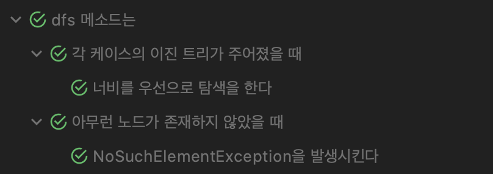

# Binary Tree

### 📖목표

> * int 값을 가지고 있는 이진 트리를 나타내는 Node 클래스 정의
>
>   int value, Node left, Node right를 가짐
>
> * BinaryTree 클래스 정의 및 주어진 노드 기준으로 출력하는 메소드 구현
>
>   * bfs(Node node)
>
>     너비 우선 탐색
>
>   * dfs(Node node)
>
>     깊이 우선 탐색(중위 순회 : 왼 → 루트 → 오른)

<br>

## 🌲이진 트리?

먼저 트리 구조란, 나무와 비슷한 모양을 가지고 있다고하여 트리라는 이름이 붙었다.

<p align="center"></p>

트리는 노드라는 하나의 단위와 노드 사이를 연결해주는 엣지로 구성된다. 나무를 뒤집어 놓은 것처럼 맨 위(Depth 0)에 존재하는 노드를 루트 노드라 하며, 맨 아래(Depth 2)의 노드들을 리프(말단) 노드라고 한다. 상위 깊이 노드는 보통 부모 노드라하고 그 하위 노드를 자식 노드라 불린다. 더 자세한 내용은 검색 혹은 밑 레퍼런스를 참고하도록 하자 :)

이진 트리는 이러한 트리 구조에서 자식 노드가 최대 2개인 트리를 말한다. 즉 노드에는 크게 담을 정보 변수와 왼쪽/오른쪽 노드의 위치가 존재한다. 아래의 그림은 최대 깊이가 3인 이진 트리이다.

<p align="center"></p>

출처 : [이진 트리 - 위키백과](https://ko.wikipedia.org/wiki/%EC%9D%B4%EC%A7%84_%ED%8A%B8%EB%A6%AC)

### 종류

이진 트리의 종류는 다양하다.

* **루트 이진 트리**

  하나의 루트 노드를 가지며 모든 노드가 최대 두개의 자식 노드를 가지는 이진 트리

* **정 이진 트리**

  모든 노드가 0개 혹은 2개의 자식 노드를 가지는 이진 트리

* **포화 이진 트리**

  모든 내부 노드가 두개의 자식 노드를 가지며, 모든 잎 노드가 동일한 깊이를 가진 이진 트리

* **완전 이진 트리**

  마지막 깊이(레벨)를 제외하고 모든 깊이(레벨)이 완전히 채워져 있는 이진 트리  
  마지막 레벨의 모든 노드는 가능한 가장 왼쪽에 존재

* **균형 이진 트리**

  보통 모든 노드의 왼쪽과 오른쪽 하위 트리의 깊이 차이가 1이하인 이진 트리

### 탐색

이진 트리에 있는 데이터를 사용하기 위해서는 노드들을 탐색하는 방법이 필요하다. 이렇게 노드를 방문하고 어떤 작업을 하는 것을 이진 트리 탐색이라 한다. 이러한 이진 트리 탐색에는 여러가지가 존재한다.

* **in-order**

  왼쪽 자식 → 자기 자신 → 오른쪽 자식 순서로 방문

* **pre-order**

  자기 자신 → 왼쪽 자식 → 오른쪽 자식 순서로 방문

* **post-order**

  왼쪽 자식 → 오른쪽 자식 → 자기 자신  순서로 방문

* **level-order**

  루트 노드 → 깊이 1인 노드들 → 깊이 2인 노드들 ... → 깊이 N인 노드들 순서로 방문

<br>

## 이진 트리 구현

우선 각 Node를 구현하여 이진 트리와 같이 구성해야 한다.

### Node

```java
public class Node {
    private int value;
    private Node left;
    private Node right;

    Node(int value) {
        this.value = value;
    }
		... getter/setter
}
```

이후, Node들을 탐색하는 메소드(bfs, dfs)가 존재하는 BinaryTree 클래스를 구현할 차례이다.

### BFS

BFS는 Breadth-First-Search의 준말로 너비를 우선적으로 탐색하는 방법을 말한다.  위 탐색 방법에서 lever-order와 같은 순회 방법이며 Queue를 이용하여 구현한다.

```java
public void bfs(Node node) {
	if(node == null) throw new NoSuchElementException("Not exist nodes..");
	Queue<Node> queue = new ArrayDeque<>();
	queue.add(node);

	while(!queue.isEmpty()) {
		Node curNode = queue.remove();
		Node left = curNode.getLeft();
		Node right = curNode.getRight();
		System.out.print(curNode.getValue() + " ");
		if(left != null) queue.add(left);
		if(right != null) queue.add(right);
	}
	System.out.println();
}
```

노드들을 큐에 넣고 하나씩 빼면서 자식 노드가 존재할 때 큐에 넣으며 이를 큐 안에 노드들이 더이상 존재하지 않을 때 종료할 수 있도록 구현하였다.


<p align="center"></p>

만약 위와 같은 이진 트리가 존재할 때, BFS 탐색을 한다면 `3 - 1 - 8 - 4 - 2` 순으로 출력된다.

### DFS

DFS는 Depth-First-Search의 준말로 깊이를 먼저 탐색하는 방법을 말한다. 위 탐색 방법에서 in/pre/post-order로 순회 방식을 선택하여 구현한다. 이는 재귀로 쉽게 구현할 수 있으며 in-order 방식을 선택하였다.

```java
public void dfs(Node node) {
	if(node == null) throw new NoSuchElementException("Not exist nodes..");
	Node left = node.getLeft();
	if(left != null) dfs(left);
	System.out.print(node.getValue() + " ");
	Node right = node.getRight();
	if(right != null) dfs(right);
}
```

왼쪽 하위 트리로 먼저 순회를 해야하므로 왼쪽 자식 노드가 `null` 이 아니라면 먼저 방문한다. 이후 자기 자신을 출력하고, 오른쪽 하위 트리 또한 왼쪽과 같은 방식으로 방문한다.

<p align="center"></p>

만약 위와 같은 이진 트리가 존재할 때, DFS(in-order) 탐색을 한다면 `4 - 1 - 8 - 5 - 3` 순으로 출력된다.

<br>

## 테스트

테스트 코드는 [여기서](https://github.com/jongnan/Java_Study_With_Whiteship/blob/master/week5/assignment/src/test/java/BinaryTreeTest.java) 확인 가능하다.

### BFS



### DFS



<br>

---

### Reference

* [트리(tree)와 이진트리(binary tree)  - ratsgo's blog](https://ratsgo.github.io/data%20structure&algorithm/2017/10/21/tree/)
* [이진 트리 - 위키백과](https://ko.wikipedia.org/wiki/%EC%9D%B4%EC%A7%84_%ED%8A%B8%EB%A6%AC)

